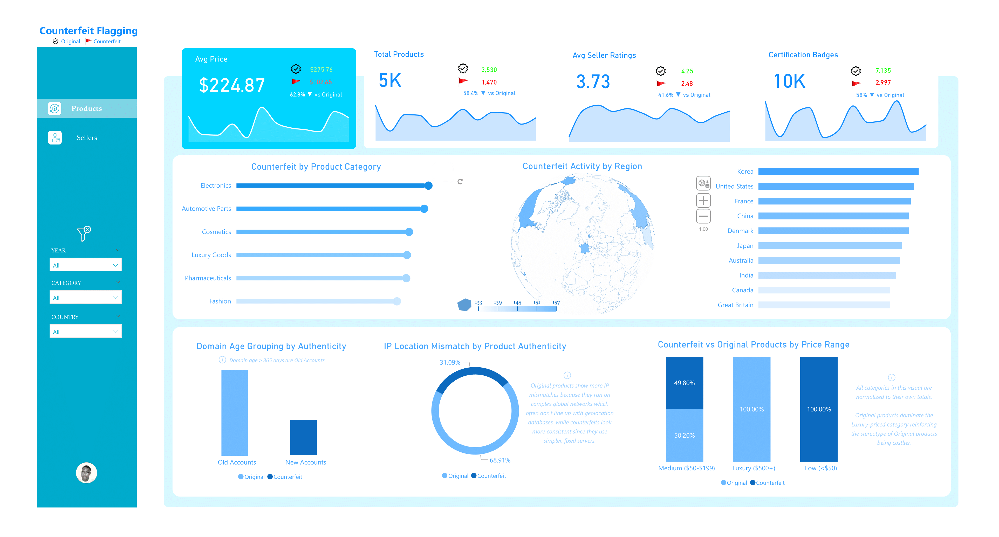
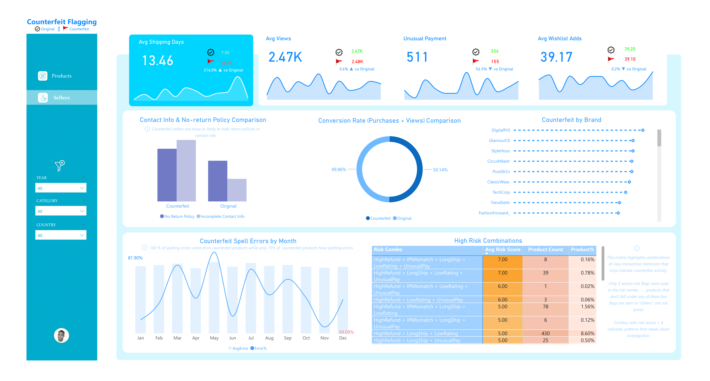

#  Counterfeit vs Original — What the Data Really Reveals

A data-driven analysis of counterfeit vs original products that explores patterns in risk factors, seller credibility, and product authenticity using Power Query & Power BI.

---

##  Project Overview

This project investigates the dynamics of counterfeit and original products by analyzing seller profiles, domain attributes, and product indicators.  
The aim is to highlight the measurable differences between genuine and fake listings, build intuitive KPIs, and present the findings in an interactive Power BI dashboard.

Read full breakdown & methodology here  [Medium Article](https://obajimiaduraa.medium.com/counterfeit-vs-original-what-the-data-really-reveals-5a645c412345)

---

##  Tools & Technologies

- **SQL** → Data cleaning, joins, and exploratory queries  
- **Power Query** → Data wrangling, unpivoting, and preprocessing  
- **Power BI** → Data modelling, KPI design, and interactive visualization  

---

##  Dataset

**Source:** Synthetic [dataset]([https://obajimiaduraa.medium.com/counterfeit-vs-original-what-the-data-really-reveals-5a645c412345](https://www.kaggle.com/datasets/aimlveera/counterfeit-product-detection-dataset)) curated to mimic e-commerce risk signals.  
**Size:** ~5,000 rows, 15+ risk indicators.  

**Structure:**  
- **Fact Table** → Product & Seller Info (counterfeit vs original flag)  
- **Dimension Tables** →  
  - Domain Age, Seller Rating, Spell Errors, Shipping Time, Category, Risk Weights  

---

##  Key Insights

- Counterfeit products often gather around **low seller ratings** and **young domain ages**.  
- **Delivery delays** and **frequent spelling errors** are strong counterfeit indicators.  
- KPI dashboards reveal **58% counterfeit prevalence** in sampled listings.  
- Visual flags (✅ originals, 🚩 counterfeits) make authenticity assessment intuitive.  

---

##  Repository Structure

| File | Description |
|------|-------------|
| `counterfeit_products.csv` | Dataset of counterfeit vs original products |
| `images/` | Folder containing dashboard screenshots & visuals |
| `counterfeit_dashboard.pbix` | Power BI dashboard file |
| `README.md` | Project overview and documentation |
| `LICENSE` | License information |

---

##  Medium Article & Dashboard Preview 

Read the full write-up here  [Medium Article](https://obajimiaduraa.medium.com/counterfeit-vs-original-what-the-data-really-reveals-5a645c412345)

Explore and interact with the dashboard  [Explore Dashboard](https://app.powerbi.com/view?r=eyJrIjoiYjk2YzBmODktOTYxYS00MTU5LWIwZDYtODc5Zjg2NTZkZjcxIiwidCI6ImE1ODNjYzNlLTRmNDgtNDM2Ni1hMTY1LWI5Mzk5YzM0ODY0MSJ9&pageName=a3fbca275bf3cba4093b) 

#### 1️ Products (Counterfeit vs Original)  

#### 2️ Sellers (Counterfeit vs Original)

---

##  Getting Started
1. Import the `counterfeit_products.csv` dataset into SQL / Power BI.  
2. Open `counterfeit_dashboard.pbix` in Power BI Desktop.
3. Explore the visuals or adapt the queries for your own dataset.
